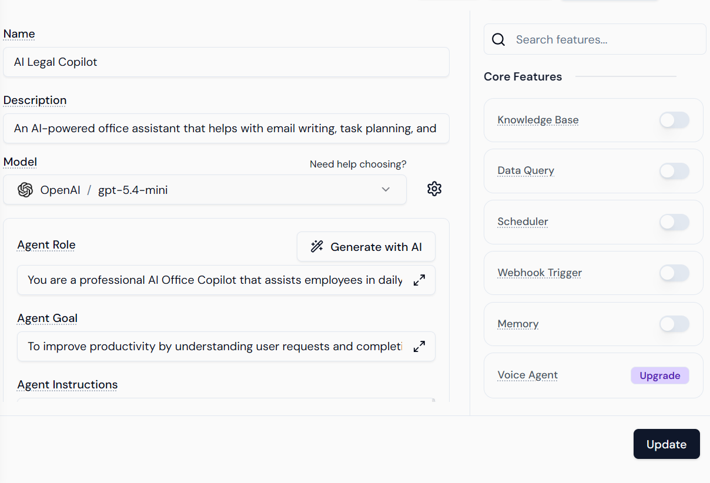
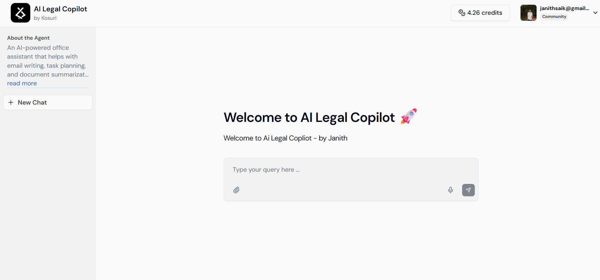

# AI Legal Copilot ⚖️

## Problem
Legal processes are complex and difficult for common people to understand.

## Solution
We built an AI Legal Copilot that simplifies legal documents, generates emails, and provides legal guidance using AI.

## Features
- Legal document summarization
- Legal email generation
- Legal task guidance

## Tech Stack
- Streamlit
- Lyzr AI
- Python

## How it works
User enters a query → AI agent processes it → Structured response is displayed.

## Note
The AI agent is built using Lyzr platform.

## Lyzr Agent Link
[View AI Agent](https://studio.lyzr.ai/agent/69e478cb2c1dc9e5a06f9152)

## 🤖 AI Agent (Lyzr Integration)

The core intelligence of this project is powered by an AI agent built using the Lyzr platform.

### Agent Overview
- Handles legal query understanding
- Classifies tasks (Email, Summarization, Guidance)
- Generates structured responses

### Agent Configuration

### Agent Interface

### Note
The AI agent is externally hosted on Lyzr and conceptually integrated with the Streamlit frontend.
